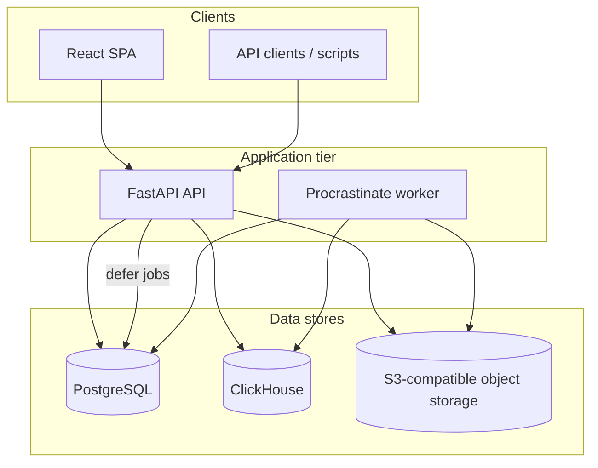
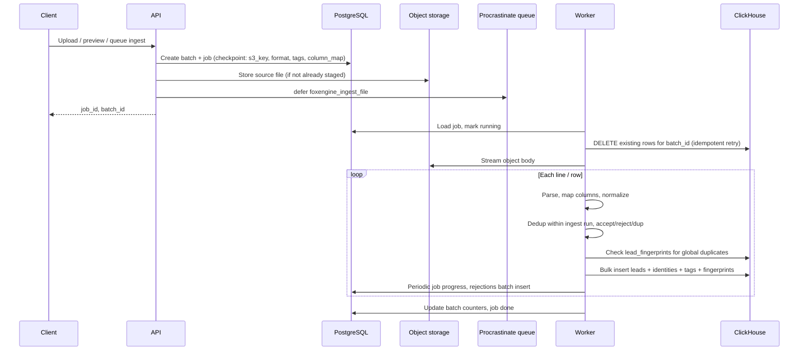
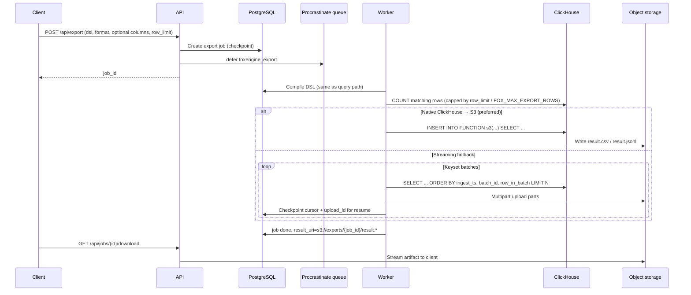

# Architecture

FoxEngine is a self-hosted lead-search platform: ingest normalized breach/PII datasets, organize them with tags, query with a small DSL, and export matching rows as background jobs. This document explains how the pieces fit together, what lives in each store, and how ingest and export move data through the system.

For API endpoints and operational behavior, see `[OPERATIONS_FUNCTIONALITIES.md](OPERATIONS_FUNCTIONALITIES.md)`.

## High-level layout

| Component                       | Role                                                                                     |
| ------------------------------- | ---------------------------------------------------------------------------------------- |
| **API** (`foxengine-api`)       | HTTP surface under `/api`, auth, query compilation, job enqueue, SPA static files        |
| **Worker** (`foxengine-worker`) | Runs background jobs from the Procrastinate queue (ingest, export, tagging, batch purge) |
| **PostgreSQL**                  | System of record: users, metadata, job state, audit, ingest rejections                   |
| **ClickHouse**                  | Analytical store: lead rows, identity index, tag assignments, batch visibility           |
| **Object storage (RustFS)**     | Upload staging, export artifacts; S3 API                                                 |
| **Optional LLM**                | OpenAI-compatible chat API for NL→DSL, column mapping, assistant                         |

Both API and worker share the same Python codebase (`backend/src/foxengine`). The job queue itself is stored in PostgreSQL via [Procrastinate](https://procrastinate.readthedocs.io/).

## Design principle: metadata vs. search data

PostgreSQL holds **small, relational, authoritative metadata** (who ingested what, job progress, tag definitions). ClickHouse holds **large, denormalized lead data** optimized for filtering and export at scale. Object storage holds **files** (raw uploads and export results).

Tag *names* and taxonomy live in Postgres; tag *assignments to rows* live in ClickHouse (`lead_tags`), keyed by Postgres tag UUIDs. Queries join tag predicates against ClickHouse using those UUIDs.

## PostgreSQL

Schema is managed with Alembic (`backend/alembic/`). Models live in `backend/src/foxengine/db/models.py`.

### Users and access

| Table        | Contents                                               |
| ------------ | ------------------------------------------------------ |
| `users`      | Accounts (username, email, password hash, active flag) |
| `roles`      | Role names (`admin`, `manager`, `operator`, `viewer`)  |
| `user_roles` | Many-to-many user ↔ role                               |
| `api_keys`   | Hashed API key secrets, owner, revocation timestamps   |

JWT signing material is encrypted at rest in `settings` (see below), not stored in plain text.

### Tags and taxonomy

| Table          | Contents                                                                                                                  |
| -------------- | ------------------------------------------------------------------------------------------------------------------------- |
| `tags`         | Tag name (case-insensitive), breach metadata (`source_url`, `breach_date`, `type`, `notes`), soft-delete via `deleted_at` |
| `tag_families` | Optional grouping codes for tags                                                                                          |

Tags are created on demand during ingest if a name does not exist yet.

### Batches and jobs

| Table               | Contents                                                                                                                                                                                 |
| ------------------- | ---------------------------------------------------------------------------------------------------------------------------------------------------------------------------------------- |
| `batches`           | Ingest unit: name, source filename/SHA-256, row counters (`accepted_rows`, `rejected_rows`, `duplicate_rows`), `ingested_by`, soft-delete (`deleted_at`), purge completion (`purged_at`) |
| `jobs`              | Background work: type, state, owner, optional `batch_id`, progress counters, JSON `checkpoint` (resume state), `result_uri`, errors                                                      |
| `ingest_rejections` | Per-batch rejected lines: line number, reason, raw snippet (for CSV download)                                                                                                            |

Job types handled by the worker: `ingest_file`, `export`, `bulk_tag`, `batch_tag`, `batch_purge`.

### Other

| Table         | Contents                                                                 |
| ------------- | ------------------------------------------------------------------------ |
| `saved_views` | Per-user saved DSL queries                                               |
| `settings`    | Key/value JSONB; includes Fernet-encrypted JWT secret                    |
| `audit_log`   | Append-only audit trail (actor, action, target, details, IP, user agent) |

Procrastinate also creates its own tables in the same database for the job queue.

## ClickHouse

Schema is applied at API startup from `backend/src/foxengine/clickhouse_schema.py`.

### `leads`

One row per accepted lead. Core columns:

- **Keys:** `batch_id`, `row_in_batch`, `ingest_ts`
- **Identity:** `phone`, `email`, `username`, `id_card` — one stored value per field (no separate raw/normalized columns)
- **Materialized:** `email_local`, `email_domain` (parsed from `email` for `email.local` / `email.domain` DSL predicates)
- **Profile:** name, DOB, gender, address, city, country, zip, IP, user agent, ISP, carrier, password fields, `last_seen`
- **Flexible:** `extras` (`Map(String, String)`) for unmapped source columns

Canonical values are written at ingest (`identity.py`) and reused everywhere: dedup hashes, `lead_identities`, related-row expansion, and export. N-gram bloom indexes on `phone`, `email`, `username`, and `id_card` support substring-style predicates on lead columns; identity DSL predicates (`phone`, `email`, `username`, `id_card`) typically resolve via `lead_identities` instead.

Engine: `MergeTree`, partitioned by month of `ingest_ts`, ordered by `(ingest_ts, batch_id, row_in_batch)`.

### `lead_identities`

Denormalized identity facets for fast “related rows” and identity-based filters. Each non-empty identity on a lead produces one row: `(identity_kind, identity_value, batch_id, row_in_batch, ingest_ts)` where `identity_kind` is `email`, `phone`, `username`, or `id_card`. `identity_value` matches the canonical stored on `leads` (usernames are lowercased in this index for consistent matching).

### `lead_tags`

Links leads to tags: `(tag_id, batch_id, row_in_batch, assigned_at, source)`. `tag_id` is the Postgres tag UUID. Engine: `ReplacingMergeTree(assigned_at)` so re-assignments keep the latest timestamp.

### `lead_fingerprints`

Global exact-row deduplication index. Each accepted lead row writes `(row_hash, batch_id, row_in_batch, ingest_ts)` where `row_hash` is the SHA-256 of normalized canonical lead fields plus sorted `extras`.

During ingest, each flush checks pending row hashes against this table. Matches increment `duplicate_rows` and are skipped. The table is also deleted by batch purge so purged data can be re-ingested.

Query compilation (`job_queries.py`) automatically excludes batches with `deleted_at` set in Postgres.

## Object storage

Two buckets (names configurable via `FOX_S3_BUCKET_*`):

| Bucket    | Typical keys                                       | Purpose                                                                  |
| --------- | -------------------------------------------------- | ------------------------------------------------------------------------ |
| `uploads` | `uploads/staged/{upload_id}/…`, ingest source keys | Staged files during preview/queue; worker reads ingest sources from here |
| `exports` | `exports/{job_id}/result.csv` or `result.jsonl`    | Completed export artifacts                                               |

The API ensures buckets exist at startup. Staged upload objects are deleted after a successful ingest queue commit.

## Query path (context for export)

1. Client sends a DSL string to `POST /api/query` or starts export with the same DSL.
2. Parser builds an AST (`dsl/parser.py`).
3. Tag names in predicates are resolved to UUIDs from Postgres (`tags_resolve.py`).
4. AST compiles to a ClickHouse `WHERE` clause (`dsl/sql.py`), possibly with a tag-keys subquery for tag-heavy plans.
5. Deleted/hidden batches are appended to the filter (`deleted_batches.py`).
6. Interactive queries run paginated `SELECT`s; exports use the same compiled filter (see below).

DSL identity predicates (`phone`, `email`, `username`, `id_card`, `phone.country`) compile to subqueries on `lead_identities`. Profile and `email.local` / `email.domain` predicates filter `leads` columns directly. The related-rows view loads extra leads that share any canonical identity with the current result set (`email`, `phone`, `username`, `id_card` on `leads`).

## Ingest process

Ingest turns uploaded files (or a small JSON payload) into ClickHouse rows plus Postgres batch/job metadata.

### Entry points

| Path                                                  | When used                                                                                     |
| ----------------------------------------------------- | --------------------------------------------------------------------------------------------- |
| Preview → queue (`POST /api/ingest/file/from-upload`) | Normal UI flow: format detection, column mapping, then background job                         |
| Direct upload (`POST /api/ingest/file`)               | One-step queue without separate staging UI                                                    |
| Sync index (`POST /api/index`)                        | Small payloads (≤ `FOX_MAX_INDEX_ROWS_SYNC`, default 5000); API writes directly to ClickHouse |

Large file ingest is always asynchronous: the API creates a `Batch` + `Job`, stores the source in object storage, and defers `foxengine_ingest_file`.

### End-to-end flow (file ingest)

### Parsing and normalization

Supported formats: **JSONL**, **CSV** (configurable delimiter), **TXT** (line-oriented), **combo** (typed lines), and **archives** containing those types.

For each raw record:

1. **Column mapping** maps source headers/keys to canonical field names (`phone`, `email`, `username`, etc.). Unmapped columns go into `extras`. LLM or manual maps can be supplied; known field names also match case-insensitively when fallback is enabled.
2. **Normalization** (`identity.py`), stored on `leads` as the single canonical value:
   - **Email:** trimmed, lowercased.
   - **Phone:** parsed with libphonenumber; valid numbers stored as E.164. Invalid or unparseable input is kept as trimmed text (not dropped) so a row can still ingest when another identity is present. Optional `default_phone_region` on ingest helps bare national numbers in CSV.
   - **Username / id_card:** trimmed strings (username matching in `lead_identities` uses lowercase).
3. **Validation:** at least one non-empty identity after normalization; otherwise the row is **rejected** and stored in Postgres `ingest_rejections`.
4. **Within-batch dedup:** SHA-256 of canonical `phone`, `email`, `username`, `id_card`, profile fields, and sorted `extras`; duplicates increment `duplicate_rows` and are skipped.
5. **Global exact-row dedup:** pending row hashes are checked against `lead_fingerprints`; existing hashes increment `duplicate_rows` and are skipped.
6. **Materialization:** accepted rows become inserts into `leads`, corresponding rows in `lead_identities`, optional `lead_tags` for requested tag names, and `lead_fingerprints`.

Duplicate **files** (same SHA-256) can be rejected at queue time unless explicitly allowed.

### Tuning

| Setting                     | Default | Effect                                    |
| --------------------------- | ------- | ----------------------------------------- |
| `FOX_INGEST_FLUSH_ROWS`     | 50000   | ClickHouse insert batch size              |
| `FOX_INGEST_PROGRESS_EVERY` | 50000   | How often job `processed_rows` is updated |
| `FOX_WORKER_CONCURRENCY`    | 4       | Parallel tasks per worker process         |

Scale horizontally with multiple worker containers.

## Export process

Export runs a DSL filter against ClickHouse and writes a CSV or JSONL file to object storage. It is always asynchronous (`POST /api/export` → `foxengine_export` job).

### End-to-end flow

### Compilation and limits

The worker reuses `compile_leads_where()` so export respects the same DSL semantics and batch visibility rules as interactive query.

- **Row cap:** `FOX_MAX_EXPORT_ROWS` (default 5M), further reduced by per-request `row_limit`.
- **Columns:** optional subset of lead fields (`phone`, `email`, `email_local`, `email_domain`, profile columns, `extras`, etc.); defaults to the full export column list in `export_query.py`.

### Export strategies

1. **Native `ch_s3` (default when `FOX_EXPORT_USE_CH_S3=true`):** ClickHouse runs `INSERT INTO FUNCTION s3(...)` with the compiled `SELECT`, writing directly to `exports/{job_id}/result.{csv|jsonl}`. Progress is polled via ClickHouse `system.processes` using a dedicated `query_id`.
2. **Streaming fallback:** If native export fails, or the job is resuming from a checkpoint, the worker keyset-paginates with cursor `(ingest_ts, batch_id, row_in_batch)`, encodes CSV/JSONL in Python, and uploads via S3 multipart API (`ExportS3Writer`). Checkpoints store `resume_cursor`, `s3_upload_id`, and completed parts so a failed job can continue.

Force streaming by setting `export_method: stream` in the job checkpoint (used internally after fallback).

### Download

Completed jobs expose `result_uri`. Clients use `GET /api/jobs/{job_id}/download` to stream the object from the exports bucket.

## Batch deletion and purge

Admin batch delete is a two-phase pattern:

1. **Postgres:** set `batches.deleted_at`; queries immediately exclude the batch via `deleted_batch_sql_clause`.
2. **ClickHouse:** queue `foxengine_purge_batch`.
3. **Purge job:** lightweight `DELETE FROM` on `leads`, `lead_identities`, `lead_tags`, and `lead_fingerprints` for that `batch_id`; poll until counts reach zero; set `purged_at`.

This avoids long-running `ALTER DELETE` mutations during ingest-heavy workloads.

## Startup sequence

On API lifespan (`main.py`):

1. Start audit log batch writer
2. Ensure ClickHouse DDL
3. Ensure Procrastinate schema
4. Seed initial admin from JSON if present
5. Load JWT secret from encrypted settings
6. Open Procrastinate app context
7. Create S3 buckets if missing

The worker waits for Postgres, applies Procrastinate schema, then runs `foxengine-worker` with configured concurrency.

## Related documentation

- `[README.md](../README.md)` — quick start and configuration overview
- `[OPERATIONS_FUNCTIONALITIES.md](OPERATIONS_FUNCTIONALITIES.md)` — endpoints, roles, and UI behavior
- `[LLM.md](LLM.md)` — optional NL→DSL and assistant integration
- `[openapi.json](openapi.json)` — generated HTTP API spec
